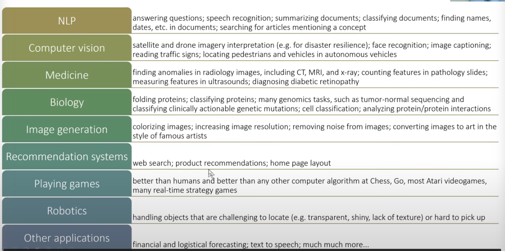
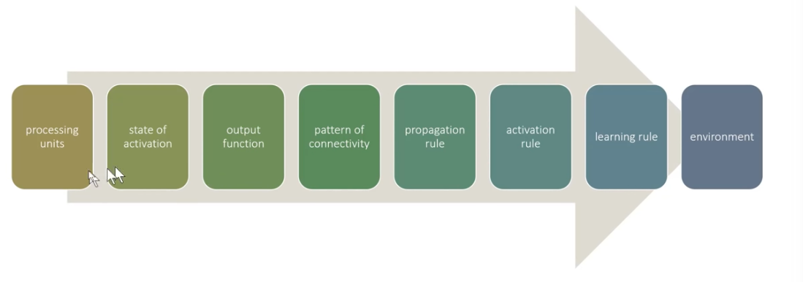

# Lesson 1
https://github.com/fastai/fastbook/blob/master/01_intro.ipynb

Deep learning has many applications: 

## history 

1943 - Warren McCulloch and Walter Pitts – mathematical model of artificial neuron 
1950 - Frank Rosenblatt - first perceptron 

First "AI Winter" - Minsky and Papert wrote Perceptrons. Showed a single layer of perceptrons weren't able to learn simple math functions – also showed that multiple layers could learn this but people ignored this. 

In 1986, MIT - Parallel Distributed Processing - PDP 

In 80s, Proved that second layer could actually allow any mathematical model to be approximated, but this is too big and slow. The key is to use even more layers of neurons (made possible by more data and better computer hardware). 

## Class principles

David Perkins - best way to learn is to start by "playing the whole game" - develop a sense of understanding of the whole piece. Ie top down vs bottom up – starting with context. Next: make the game worth playing. Have a competition, keep score, motivate the problem. 

## Tools

Tensorflow – everybody was using this but got bogged down, nobody using it anymore
PyTorch - easier to use, better for researchers 20% => 80% of papers. Missing higher level APIs. 
fastai - sits on top of PyTorch

## What's happening in the first exercise
what is machine learning? a way to get a computer to complete a task when the steps aren't clear, eg recognizing objects in photos. 
Arthur Samuel - 1949 - need to spell out every minute step of each process is intractable – instead give it examples and let it figure out how to solve it itself. Built a checkers bot that beat the state champ of Connecticut. 

process for training a machine learning model = inputs + weights => model => results => measure performance and update weights 

**machine learning**: training of programs developed by allowing a computer to learn from its experience rather than through manually coding the individual steps. 

**universal approximation theorem**: neural network can solve any problem to any level of accuracy (in theory)

how to find the right weights / train the NN? 

**stochastic gradient descent / SGD** - 

model = architecture (structure of the function to parameterize)

weights = parameters to the function 

results = predictions based on independent data

loss = performance

Limitations: 
- you need data to train the model 
- model can only learn patterns based on what you show it 
- data must be labeled 

Other resources: 
- https://spinningup.openai.com/en/latest/index.html
- https://www.deeplearningbook.org/

Validation set: data withheld from training to test the model for overfitting. 

CNN - convolutional neural network - state of the art approach for computer vision models. 

segmentation: recognizing contents of individual pixels in an image. 

Hot tips: 
- using pre-trained models is generally undervalued - this is called transfer learning
- watch out for overfitting, but don't worry about it until you have the problem. 
- can you transform your data into a form that makes it easier for the model to recognize features? eg sounds to spectrograms, time series data to a graph or even better to a colorized chart, mouse speed/clicks from a session into a colorized image on black and white, or even a binary file into a grayscale image. 
    - thus having a good idea of what datasets exist, and what pretrained models exist, is an advantage / good starting point. 

Ongoing questions: 

- what the hell is the actual model? how is it possible to strip off a layer from a pre-trained model and then fit that model to my dataset when my data could be anything? is the model just like a matrix of numbers? 

## Retention Questions

Do you need these for deep learning?

Lots of math F
Lots of data  F
Lots of expensive computers F
A PhD F
Name five areas where deep learning is now the best in the world.

- robotics - for recognizing objects & how to manipulate them
- NLP - sentiment analysis, translation
- image recognition - detection of malignant tumors in CT scans. 

What was the name of the first device that was based on the principle of the artificial neuron?

- Mark 1 Perceptron - was able to recognize simple shapes. 

Based on the book of the same name, what are the requirements for parallel distributed processing (PDP)?

- processing units => activation state => output => connections between units, a way to propagate in the network. 

What were the two theoretical misunderstandings that held back the field of neural networks?

- using layers was important for a perceptron to be able to learn more complicated things, and improvements in computer hardware. 

What is a GPU?

- Graphical Processing Unit - a processor chip that can do many calculations/tasks in parallel, designed for 3d environments gaming/graphics which requires a lot of linear algebra. 

Complete the Jupyter Notebook online appendix.
Why is it hard to use a traditional computer program to recognize images in a photo?

- because you have to encode a bunch of procedural rules, and it's near impossible to account for all edge cases. 

What did Samuel mean by "weight assignment"?

- scaling up or down the important of input variables / features. 

What term do we normally use in deep learning for what Samuel called "weights"?

- parameters 

Draw a picture that summarizes Samuel's view of a machine learning model.
Why is it hard to understand why a deep learning model makes a particular prediction?

- because the decision is composed of many different inputs / layers. 

What is the name of the theorem that shows that a neural network can solve any mathematical problem to any level of accuracy?

- universal approximation theorem 

What do you need in order to train a model?

- data, labels

How could a feedback loop impact the rollout of a predictive policing model?

- it could be self-reinforcing or a positive loop, so it's not actually predicting crime but arrests and reinforcing police behavior. so prediction can affect the real world behavior and reinforce the prediction. 

Do we always have to use 224×224-pixel images with the cat recognition model?

- nope, tradeoff between accuracy and time to train. 

What is the difference between classification and regression?

- classification is making a prediction from a discrete set of possibilities (eg putting it into a bucket) vs a regression is making a prediction along a scale, eg temperature, cost. 

What is a validation set? What is a test set? Why do we need them?

- validation set is withheld from the model to guard against overfitting
- test set is withheld from model and human to guard against human bias to overfit via trial and error

What will fastai do if you don't provide a validation set?

- default to witholding 20% 

Can we always use a random sample for a validation set? Why or why not?

- not always. you want the validation and test set to be representative of what you want to predict. If you want to predict the future, your validation/test should be in the future, not scattered across time. 

What is overfitting? Provide an example.

- when the model memorizes the input, eg titanic dataset, just memorizing who survives. 

What is a metric? How does it differ from "loss"?

- function to evaluate the performance of a model that a human can interpret. loss is similar, but used by the system to update the weights automatically (but may not be easy for a human to interpret. )

How can pretrained models help?

- they can be fine tuned to your dataset, preventing the need for going through and doing lots of expensive training. 

What is the "head" of a model?

- the starting point at which you are fine tuning (generally the pre-trained model minus one layer)

What kinds of features do the early layers of a CNN find? How about the later layers?

- the early layers find simple patterns like edges, corners, and the later layers find more complex and specialized patterns like faces. This is simular to how the cortical layers in our occipital lobe work. 

Are image models only useful for photos?

- no they can be used for other data that is transformed into an image. 

What is an "architecture"?

- how the layers fit together - the size of each layer and how they feed into each other. 

What is segmentation?

- extracting meaning from pixels (eg recognizing objects in the image)

What is y_range used for? When do we need it?

- the target when predicting a continuous variable (eg predict between n => n1)

What are "hyperparameters"?

- choices about the network architecture, learning rate, how to augment the data, etc. – things that aren't necessarily part of the actual training data, but choices made by the machine learning engineer. 

What's the best way to avoid failures when using AI in an organization?

- choose good test and validation sets. use metrics that actually matter in practice to evaluate performance. 
