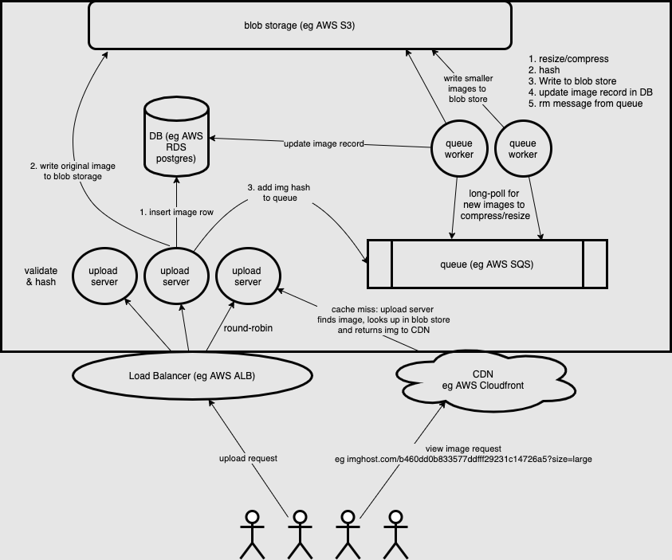

TODO: 

1. ERD 
2. cost estimate 
3. Review numbers -- do we even need a queue? Did I do the math wrong?

# Problem Statement

Design an image hosting service. Users should be able to upload "normal sized" images and receive a link that they can share with others to view the image at various sizes/resolutions. 

# Functional Requirements
- must be able to upload images
- must receive shareable link
- must be able to view image in various sizes/qualities via URL parameters
- must have basic analytics
- links/images do not expire 
- should support editing / cropping in future

# Non-functional Requirements
- must support 500k uploads per day 
- must support 5M views per day 
- serves a global userbase 

# Out of scope
- moderation 
- takedowns/DCMA
- albums/photo organization 

# SLOs
- users receive a shareable URL within 10 seconds after upload
- 95% of users experience <300ms load times for viewing images
- 99% available for uploads
- 99.9% available for viewing images 

# Load Estimation 

Let's assume that a "normal sized" image would be a high-quality JPG, taken from a smartphone. (TODO: how do other image formats change these assumptions). Let's assume the input image will be around 2MB and that this will be the bulk of the write payload. We will have some photo metadata to store along with the image, but we can assume it will be dwarfed by the image size (eg max 1-5KB of metadata). We also are going to want to generate large, medium, and small image sizes. Let's assume that we can generate the large with a 10:1 compression ratio, the medium with a 20:1, and the small with a 30:1 compression. Thus: large = 10% of original (200kb), medium = 5% of original (100kb) and small = 2.5% of original (50kb). So for each photo, we will store an additional ~500kb in resized/compressed images.  

## Write load

|Avg image size|# of writes per day|# of writes per year|#of writes per second|bandwidth|
|---|---|---|---|---|
|2MB + 500kb | 500e3, 1.25TB | 182.5e6, ~500TB|~6/s|12MB/s (original 2MB*6)|

## Read Load 
Let's assume most reads will be for the high quality compressed version (not the original) which we expect to be about 200KB. 

|Avg read image size|# of read per day|# of reads per year|#of reads per second|bandwidth|
|---|---|---|---|---|
|200KB | 5e6 | 1.325e9 | ~60/s | 12MB/s (200KB * 60)|

Interestingly, even though we have 10:1 reads to writes, our required read and write bandwidth is approximately the same.

# Storage 

We are going to need to store about 500TB per year in images. Since these are chunky binary objects, it makes sense to store these in blob storage solution such as S3.  

Let's think through how to store the rest of the system data. At a minimum, we'll want to have a record of the systems users, the photos they have uploaded (metadata about these photos and pointers to the various sizes in our blob storage solution). We also know we are going to have ~200 million photos uploaded per year. If we assume each user uploads 20 photos, we have 20M user records per year. 

We know that at a minimum we want to be able to do fast lookups based on the image key. Initially this might indicate that a KV store would be a good choice here. However, in future, we may want to be able to query based on relationships between users and photos (eg to show a dashboard to the user). For downstream image processing, we will also want to take advantage of ACID features we get in a relational DB. Also, as we will see below, the amount of data we need to store annually is relatively small, so we likely won't have to think about partitioning for a few years so the added complexity of partitioning our relational DB shouldn't be a major factor in our decision making process. 

If two users upload the same photo, we don't want to reprocess it. We can use a hash function (eg MD5 could be fine because it's sort of fast and we don't need cryptographic guarantees) to generate deterministic IDs for each piece of unique content uploaded. If a second user uploads the same exact photo, once we hash it we will see we already have a record for this image and associat the existing record with the second user in addition to the first.

We can have 3 tables: 

Users
UserImages
Images

TODO Insert ERD here
```
user record ~ 500 bytes each, .5 KB per user = 10e6 KB => 10GB of user data per year. 
{
    username: {  (50 bytes)
        first_name: (50 bytes)
        last_name:  (50 bytes)
        created_on: (8 bytes)
        photos: [photoUCK1, photoUCK2] ~(16 bytes per photo, assume ~20, so 320 bytes)
    }
}
photo record: (~50-100 bytes per photo), 1KB per 10 photos = 20 GB of photo metadata per year. Also tiny.
{
    # each ID is a 128 bit MD5 hex digest, so 16 bytes. 
    photoUCK: {  (16 bytes)
        large: 16 bytes
        medium: 16 bytes
        small: 16 bytes
        ....TODO potentially some extra metadata here
    }
}
```

# API Design

```
uploadImage(image)
viewImage(photoUCK, size="large") - this request falls back to the lowest quality available size that is available, eg if large isn't ready yet, it returns the original.
```

# Photo Processing 

In order to generate a shareable link within 10 seconds and also provide support for requesting multiple images, we will need to some asynchronous processing of the image once it's been uploaded. 

High level flow of an upload request: 

1. Client validates input before making request.
2. Stream the image bytes to memory on the server. 
3. Server validates the input (file type, size) eg is_jpeg()
4. Generate a hash of the image and 
   1. if does not exist, write it to our KV store as an empty record. 
   2. else: if already exists, update user record with the UCK and return the link. 
5. Stream the image to our blob storage, using the hash as the key. 
6. Put a message on a queue to alert our image processing service about a new image to resize.
7. Return shareable link to user with the image hash. 
8. Async, the image processing service will load the file back into memory, generate different sizes, write these to blob storage and update the database accordingly. If it completes successfully, it marks the message as processed from the queue. Otherwise the message remains on the queue and is retried by a different worker. 

## Load Estimation Revisited for Photo Processing

### Upload servers
Let's assume the average internet user has 3Mbps upload speed => ~375KB/s upload. this means it will take a 2MB file ~5 seconds to upload. If we begin 6 uploads per second, this means we would have 30 images in progress at any given time. Let's round this up to 50 to be safe. Assuming that the CPU time to hash and validate the images will be microseconds and that we have much faster network speeds within our datacenter (maybe 5Gbps, so 625MB/s) the rest of the request should take no more than a few ms. This means we will need 100MB of memory minimum to buffer our images for validation and hashing, and since our bottleneck is waiting on network requests (eg we don't need to do anything in parallel because the CPU is doing work only a fraction of the time), we can easily fit this workload on a single, commodity machine, eg AWS t3.small	with 2vCPUs and 2GB RAM. To improve availability, we can still load balance these requests in a round robin fashion across 2 or more commodity servers in different AZs.

### Database server
We know that we will be querying our relational DB ~60 times per second assuming worst case we miss the CDN cache every time and writing to it ~10-20 times per second, which can be easily managed by a single-node database. We can add a warm-standby with async replication to achieve our availability SLO.

### Queue consumers
We expect messages to appear on the "uploaded_images" queue at a rate of 6-10 per second. For each message, we download the image from our blob store (within datacenter, so 2MB/625MB/s would be .003 seconds per download), with all of these buffered in memory we use 20 MB memory. We resize/compress once it's fully buffered (350KB additional memory per image, ~3.5MB additional memory consumed, assume microseconds of CPU time), hash (microseconds), write new hashes to DB (50ms max), and write new objects to our blob storage (.01 seconds). So a single machine should also easily be able to handle this workload, but we can again load balance this between 2 or more servers in different AZs for availability purposes. 

# System Components

not shown: RDS would need to have a single async replication/warm standby for failover in second AZ. similarly, servers processing requests and consuming from queue would always have at least 2 up (could scale up based on load spikes), and at least one in separate AZ at any given time. 



# Cost Estimate 
- load balancer
- S3 storage
- EC2 cluster (for upload requests)
- CDN (for reads)
- message queue
- queue workers