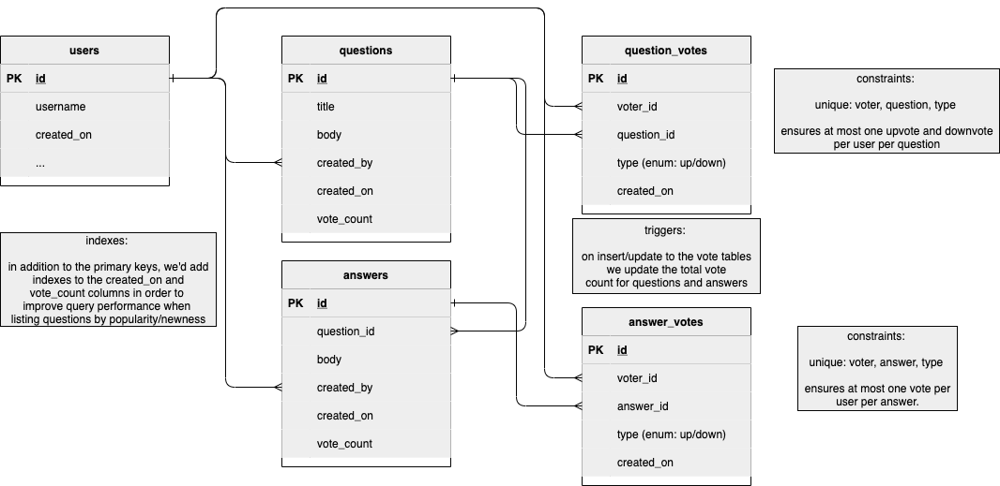
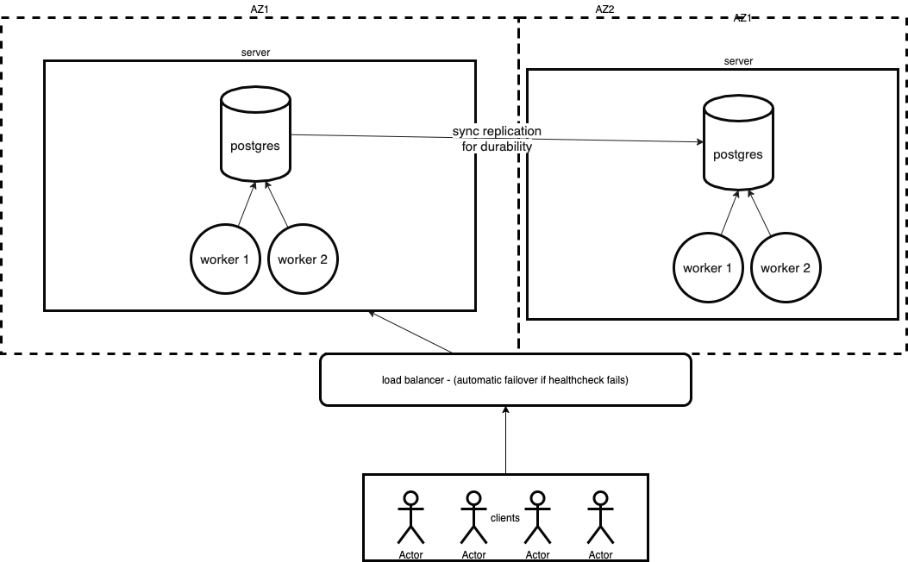

# Problem Statement

Design website for people to post questions and answers. People should be able to upvote and downvote. We want to be able to see recent questions and popular questions. 

# Functional requirements

- must be able to post questions and answers to questions
- should be able to upvote and downvote
- must be able to view recent questions, and popular questions
- (bonus): support reddit-style editing and deleting questions / answers.

# Non-functional requirements

- minimize latency, maximize availability 
- sensisible consistency guarantees for usability purposes (eg users should read their own writes) 
- userbase is restricted to single geographic region. 

# Out of scope: 
- comments, tags, badges, hot questions, search

# SLOs

- 99.9% of the time, question and answer reads and writes should complete within 1 second. 
- 99.9% of the time, submitted answers should be readable by all users within 5 seconds. 
- 99.9999% availability, ~60 minutes of downtime per year. [Ref](https://en.wikipedia.org/wiki/High_availability#Percentage_calculation). Essentially no downtime while still giving us wiggle room for an occassional brief outage or a few tight maintenance windows if needed. 

# System Data

Our two main objects are going to be questions and answers. We will think through the schema below, but to get a rough sense of load we can assume that the bulk of the size will come in the qustion and answer bodies. Let's assume we limit these to be 5k characters in length, and thus assume the average size of these will fall around 5k because most will be smaller and we can generously estimate we will have another 1k of metadata like the creator ID, summary, created_on and edited_on timestamps, etc. 

We can assume that the number of users will grow much more slowly relative to the number of questions and answers, and let's assume that storage of upvotes and downvotes will also be small enough to ignore for estimation purposes. 

## question

```
created_by uuid fk (16 bytes)
title varchar (200 bytes)
body varchar (5000 bytes)
created_on timestamp (8 bytes)
updated_on timestamp (8 bytes)
```

## answer
```
question_id uuid (16 bytes)
created_by uuid fk (16 bytes)
body varchar (5000 bytes)
created_on timestamp (8 bytes)
updated_on timestamp (8 bytes)
```

## Load Estimation 

|Resource|# Per year|# Per Day|# Per Second|Bandwidth|Storage Per Year|
|-------------|------------|----------|----------------|-----------------|---|
|Questions|5e6|13.6e3|0.16|~0.8KB/s (5KB objects * .16 rps)|~25GB (5KB * 5e6)|
|Answers|20e6|54.8e3|~0.65|~3.25KB/s (5KB objects * ~.65 rps)|~100GB (5KB * 20e6)|
|Views|500e6|1.3e6|~16.2|Let's assume ~50kb for a question detail page or listing a set of popular / recent questions. ~1MB/s|n/a (treating analytics / logs as out of scope)

### Could we fit this workload on a single machine?

For storage, with a modern SSD we can estimate ~3k IOPS as a baseline. [Ref: AWS EBS volumes](https://aws.amazon.com/ebs/features/). If we assume it takes us 2 I/Os per second for each write, we are looking at ~4 IOPS total for writes. For reads, if we assume we went to disk every time we'd need at least 20 IOPS. So basically we'd need about 25 IOPS so this would easily fit on a single disk, and we wouldn't even really need to pay for an SSD because it would actually fit on a HDD with 200 IOPS.

In short, it seems feasible that we could fit this workload on a single machine and disk. We will still need to introduce some redundancy in order to meet our uptime SLO, but we can assume that these will just be warm-standby instances in case of hardware failure or power outage.

# API Design 
We can assume that users interact with the API through a client (mobile app/web app) and that they are authenticated. A request header will identify the user and thus is not included in our API method signatures. 

```
createQuestion(title, body)
createAnswer(question_id, body)
listQuestions(sort=new|popular, page=1, page_size=25)
viewQuestion(question_id)
upvoteAnswer(answer_id)
upvoteQuestion(question_id)
downvoteAnswer(answer_id)
downvoteQuestion(question_id)
```

# Storage & Schema

Our data (users, answers, questions, up/down votes) is highly interrelated, and we will need to query those relationships in a variety of ways to meet the functional requirements for the application (eg finding answers related to questions, incrementing and decrementing vote counts for answers and questions). Thus it makes sense to use a relational data store such as Postgres to store our data. 



# Components

We know that we can fit our workload on a single machine, but in order to meet our SLO of 99.9999% availability, we'll need to ensure we have redundancy in case of hardware failures or power outages in an AZ. We can place one server in two different AZs with a load balancer in front of these. Writes can be synchronously replicated between servers. If a health check fails in one-AZ, it can start sending traffic to the other AZ while the first one is manually recovered. 



# Risks / Unknowns

Assuming a non-exponential growth rate with this design is a potential risk. The current design could actually be vertically scaled to double capacity. The first bottleneck we'd probably hit would be read throughput, so we could add an in-memory cache component to reduce the number of disk IOs. 

# Cost Estimate

|Component|Notes|per hour cost|Monthly cost|
|---|---|---|---|
|load balancer|standard ALB|$0.0225|16.20|
|servers|ec2-backed ecs, min 2, 16GB|$0.1664 per instance|239.65|

So you could run this setup for about $250/month. It could be half that cost if we were ok with a slightly less aggressive SLO for uptime.

# Questions for class

- it feels like there is potentially a checklist/framework of questions we can start asking ourselves to help get our heads around each problem. It's like: 1) understand the basic nature of the data - what are the heavy parts then 2) understand the access pattern (volume of reads vs writes, skew) 3) then figure out bandwidth, storage/IOPS, and memory utilization 4) and compare that to some mental benchmark of what you can get with standard hardware to justify the infrastructure. 
  - basically I feel like I'm just jumping immediately from "yeah in theory it should fit on one machine" to "but we definitely are going to need all these highly available components". 
- what's a really clean way to justify a storage solution? especially NoSQL stores. I get hung up on feeling like a KV store could just be a relational table with the primary key column as the key! Probably due to inexperience using NoSQL / KV stores in production.
- feels like there are "lego blocks" that we need to be familiar enough with to speak to. Eg I know that tools like Redis/Memcached exist, but having never used them I only have a high-level familiarity. Same with a KV store. 