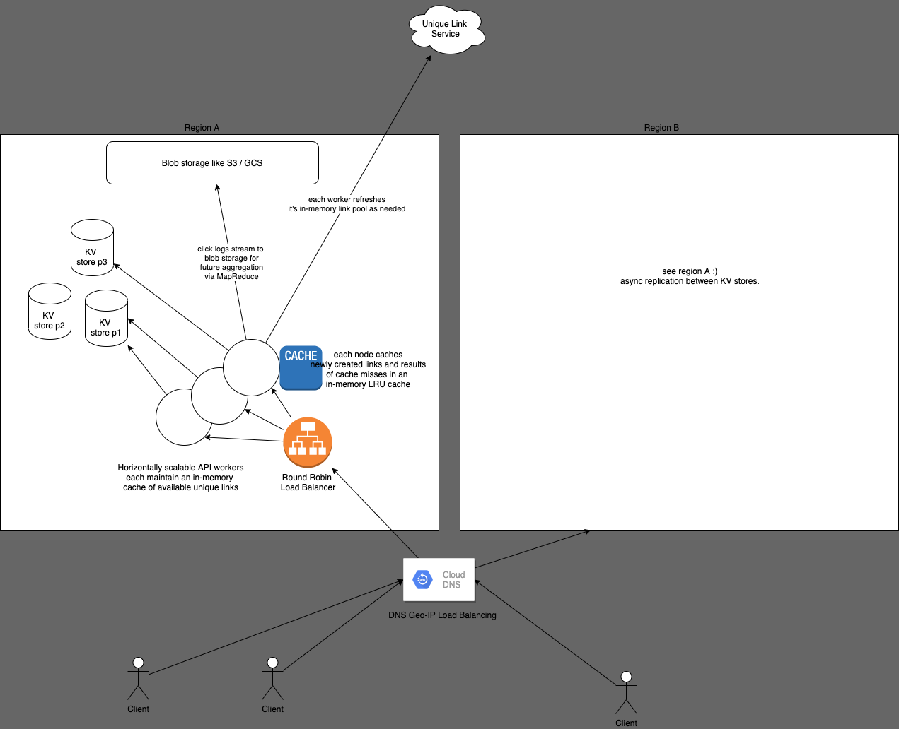

# URL Shortener

## Problem Statement

Design a URL shortener that can be used to redirect from a short URL to the original URL, collecting as much metadata about the clicker as possible for shady purposes. 

## User Requirements

- User should be able to send us a link and receive a shortened version of that link that redirects to the original link.
- Design should not prevent us from being able to customize the shortened URL in future, but for now assume it's our own domain + TLD + unique shortened path. 
- Shortened URLs should be distinct per creator (eg if 2 users shorten wikipedia.org, they should get two different shortened URLs)

## Technical Requirements / SLOs
- We expect 10M links to be shortened per day, with writes relatively evenly distributed throughout the day. 
- We expect each link to be clicked on average 100 times per URL over it's lifetime, but majority of clicks within the first day or two. 
- (assumption) Let's limit the length of the input URL to 2000 chars, even though URLs can technically be larger than that according to the RFC. 
- We want to record as much metadata about a click event as possible (IP, OS, browser, resolution, battery level, language settings, TZ, browser extensions, etc)
- Minimize latency, maximize availability. 

## Estimations

### writes 
- write volume: 10M writes per day / 84600 s = ~120 writes per second.
- link volume: 10M links per day * 365 = 3.65B => ~4B links per year or ~40 billion over 10 years. 
- link storage: 1 link could be up to 2KB, but most will be much shorter, so assume 1KB per link, userID, and shortened link on the high end => 4e9 KB => 4TB per year
- write bandwidth: 120 KB / s

### reads 
- read / click volume: assume 90% of clicks come in the first day, so 10M links, 90 clicks per link => 900M rpd = ~ 11k reads per second, ~350B reads per year, 3.5 trillion clicks in 10 years
- storage: assume we collect 1kb of metadata from the user per click, 350e9 KB => 350 TB / year of click data. 
- read bandwidth: our response to the shortened URL is going to be html with some inlined fingerprinting javascript to scrape metadata, fire off the click log, and then redirect. Inlining all of this, we might expect it to be around 10kb. 
- 11e4 kb => 110 MB / second. We'll want to leverage caching here as much as we can. 

### link generation 

#### hashing
- Due to the requirement that each shortened link be unique, we could consider a strategy where we hash the link and mod it to our address space, but because this is deterministic it could be used as an attack vector, and why risk remote chance of a collision when hashing doesn't provide a clear benefit (other than being able to generate the link on the fly). 

Also, one of the requirements here is that we return a unique shortened link per user. What if a user had a use case where they wanted to generate two shortened URLs for the same target? We wouldn't be able to support this cleanly with a hashing strategy. 

#### pre-generation 
- we want to be sure that we never run out of links, and we can't predict if demand will grow in the future so let's make sure we won't run out for 100 years given our current load estimate? 
- 4B links per year means 4e11 in 100 years or 400 billion unique links. 
- we want our links as short as possible, and assuming readable-ish, which means no characters that require URL encoding and no punctation if we can help it. 
- uppercase is equivalent to lowercase, so we have [a-z] and [0-9] to work with basically, which is 36 total characters. 
- if we assume we want to limit to about 5-10 chars, plus the domain and tld, 36^8 => 656,100,000,000. Worst case scenario in 2122 if the internet still exists they can add another character. 
- So if each link is 8 chars, 8 bytes => 5.248e12 B => 5.248 TB of ids if we generated all 656 billion.
- We can put these links into a central store and individual service nodes can request new links to use from this service, ensuring that we don't distribute duplicated links. This could just be a single table relational DB (partitioned) to take advantage of ACID transactions, marking links that are consumed as used.  

## Storage

It makes sense to use a highly-available key value store (dynamo, cassandra) vs a relational database as our primary storage, because all we really need to be able to do is store the short URL as the key to the long-url and user ID. We wouldn't need a relational DB for anything it's good for, like querying.

At 4TB of storage per year, we'd have no trouble storing all of this data on a single disk for quite awhile, but for high-availability we are going to want to replicate it across least 2 AZs / regions. 

For click storage, we know we want to use that information for analytics later, so it makes sense to just log each click and send it off to a data lake / blob storage. Downstream we could layer on MapReduce jobs to aggregate metrics we care about and then push these into a datastore to serve our analytics dashboard. 

## Major Components
- for HA purposes, let's assume we have a 3 datacenter setup, multi-leader setup with each datastore asynchronously replicating writes to each other, and DNS geo-IP based load balancing to direct writes to the nearest API.
- we can partition the datastore based on the hash of the key (link, user ID) to ensure an even distribution. 
- in each datacenter we have a loadbalancer that round robins requests to a server cluster which maintains an in-memory queue of available IDs (these are guaranteed unique because they have been requested from our key generator service), inserts the link into our KV store, and returns the ID to the original requester. This new entry is propagated to our other KVs around the world within a few seconds.
- each new link pair that is created is also stored in an in-memory cache and used to serve read requests. any read requests that cause a cache miss will be read from the KV store and stored in an LRU cache.  
- can cache links created in memory within past 24 hours, 10M links = 80MB + 1kb *10M => 10 GB => that will easily fit in memory on a server. 

## Architecture Diagram

## Things I missed in original design
- peeked at https://www.educative.io/courses/grokking-the-system-design-interview/m2ygV4E81AR 

1. Did not even think about partitioning.. Dang it.
2. Did not think all the way through how to store and distribute the keys once they were pre-generated. That article suggests a "Key Generation Service". 
3. I was pretty low relative to this solution on the amount of cache memory needed, and hand-wavy about how the cache would actually work (eg didn't mention redis / memcached).
4. Didn't map out the DB schema.

# Questions during class
- good rule of thumb for meeting an "HA" requirement like is having a single replica enough? 
- good rule of thumb for reaching for partitioning... 1B rows? 500M rows? 
- good rule of thumb for "how many nodes do we need in our cluster" -- is this just finding the bottleneck, like 100 rps, each request is X memory, accounting for network latency, etc. 

# Other ideas
- could completely separate out the reads and write infrastructure
- when writes happen, could publish it on a topic, have reader nodes that listen and immediately cache